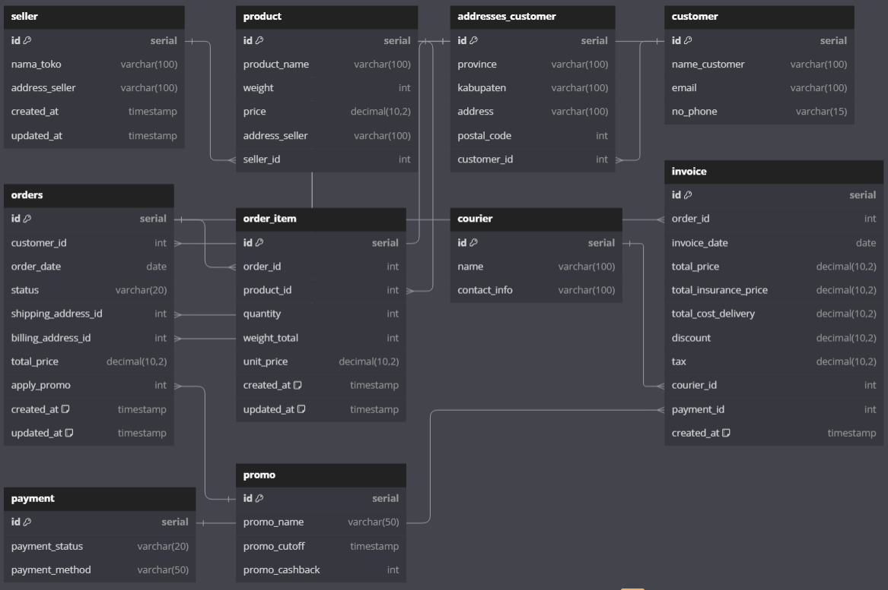

# Invoice Database Schema

This schema is designed to accommodate the data presented in the provided invoice. It aims to structure the invoice data efficiently and clearly.

### Invoice Overview

### Suggested Schema

Below is a suggested schema for the invoice database. This schema organizes the data into appropriate tables and relationships, ensuring data integrity and ease of access.

**Schema Diagram**

### Schema Details

Here’s a breakdown of the tables and their relationships in the schema:

#### Tables

1.  **Invoices**
    
    -   **invoice_id** (Primary Key): Unique identifier for each invoice.
    -   **customer_id** (Foreign Key): References the customer associated with the invoice.
    -   **date_issued**: Date when the invoice was issued.
    -   **due_date**: Date by which the payment is due.
    -   **total_amount**: Total amount due on the invoice.
2.  **Customers**
    
    -   **customer_id** (Primary Key): Unique identifier for each customer.
    -   **name**: Name of the customer.
    -   **email**: Email address of the customer.
    -   **phone**: Contact number of the customer.
    -   **address**: Physical address of the customer.
3.  **Invoice_Items**
    
    -   **item_id** (Primary Key): Unique identifier for each invoice item.
    -   **invoice_id** (Foreign Key): References the invoice to which the item belongs.
    -   **description**: Description of the item or service provided.
    -   **quantity**: Quantity of the item.
    -   **unit_price**: Price per unit of the item.
    -   **total_price**: Total price for the item (quantity * unit_price).
4.  **Payments**
    
    -   **payment_id** (Primary Key): Unique identifier for each payment.
    -   **invoice_id** (Foreign Key): References the invoice for which the payment is made.
    -   **payment_date**: Date when the payment was made.
    -   **amount_paid**: Amount that was paid.

### Access the Schema

You can also view and interact with the schema here: [dbdiagram.io - Invoice Database Schema](https://dbdiagram.io/d/Invoice-Database-Schema-66599d0bb65d9338792c713a)

### Conclusion

This schema is designed to ensure that all necessary data related to invoices are stored systematically and can be retrieved efficiently. Feel free to suggest improvements or raise issues if you encounter any problems.
